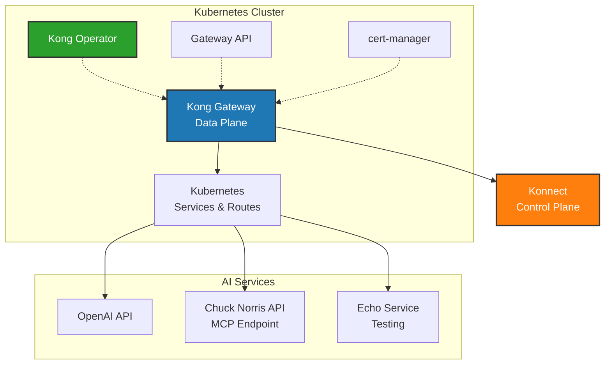

# Kong Operator AI Gateway Demo

This repository demonstrates how to set up Kong Gateway using the Kong Operator with Konnect integration, featuring AI service routing and MCP (Model Context Protocol) endpoints.

## Overview

This demo setup includes:
- Kong Gateway with Konnect cloud management
- AI service routing capabilities 
- Chuck Norris API service (MCP demo)
- Echo service for testing
- OpenAI service configuration with vault integration

## Prerequisites

- Kubernetes cluster (v1.24+)
- `kubectl` configured to access your cluster
- Helm 3.x installed
- Kong Konnect account with API token
- Environment variable `KONNECT_TOKEN` set with your Konnect API token

## Architecture



## Installation Steps

### 1. Install Gateway API

```sh
kubectl apply -f https://github.com/kubernetes-sigs/gateway-api/releases/download/v1.4.1/standard-install.yaml --server-side
```

### 2. Install cert-manager

```sh
kubectl apply -f https://github.com/cert-manager/cert-manager/releases/download/v1.20.0/cert-manager.yaml
```

### 3. Add Kong Helm Repository

```sh
helm repo add kong https://charts.konghq.com
helm repo update
```

### 4. Install Kong Operator

```sh
helm upgrade --install kong-operator kong/kong-operator -n kong-system \
  --create-namespace \
  --set image.tag=2.1 \
  --set env.ENABLE_CONTROLLER_KONNECT=true \
  --set global.webhooks.options.certManager.enabled=true
```

### 5. Create Kong Namespace

```sh
kubectl create namespace kong
```

### 6. Configure Konnect Authentication

Set your Konnect token as an environment variable:

```sh
export KONNECT_TOKEN="your-konnect-token-here"
```

Create the Konnect authentication secret:

```sh
echo 'apiVersion: v1
kind: Secret
metadata:
  name: konnect-api-auth-secret
  namespace: kong
  labels:
    konghq.com/credential: konnect
    konghq.com/secret: "true"
stringData:
  token: "'$KONNECT_TOKEN'"' | kubectl apply -f -
```

### 7. Create Konnect API Auth Configuration

```sh
echo 'apiVersion: konnect.konghq.com/v1alpha1
kind: KonnectAPIAuthConfiguration
metadata:
  name: konnect-api-auth
  namespace: kong
spec:
  type: secretRef
  secretRef:
    name: konnect-api-auth-secret
  serverURL: us.api.konghq.com' | kubectl apply -f -
```

### 8. Deploy Kong Gateway and Services

Apply all Kong configurations:

```sh
kubectl apply -f kong/
```

This will deploy:
- Kong Gateway Data Plane with Konnect integration
- Echo service for testing
- Chuck Norris API service (MCP endpoint)
- OpenAI service configuration with vault

### 9. Verify Installation

Check that all resources are running:

```sh
kubectl get all -n kong
kubectl get kongservices,kongroutes -n kong
```

## Usage Examples

### Test Echo Service

```sh
# Get the Kong Gateway external IP
KONG_IP=$(kubectl get svc -n kong -l app=ai-gateway -o jsonpath='{.items[0].status.loadBalancer.ingress[0].ip}')

# Test the echo endpoint
curl http://$KONG_IP/echo
```

### Access Chuck Norris API (MCP)

```sh
# Get a random Chuck Norris joke via MCP endpoint
curl http://$KONG_IP/mcp/chucknorris
```

### OpenAI Integration

The OpenAI service is configured with vault integration. Configure your OpenAI API key:

```sh
export OPENAI_API_KEY="your-openai-api-key"
kubectl create secret generic openai-key --from-literal=key=$OPENAI_API_KEY -n kong
```

## Configuration Files

- [`kong/kong-gateway.yaml`](kong/kong-gateway.yaml) - Main Kong Gateway configuration with Konnect integration
- [`kong/echo-service.yaml`](kong/echo-service.yaml) - Echo service and route configuration
- [`kong/chuck-mcp.yaml`](kong/chuck-mcp.yaml) - Chuck Norris API service (MCP endpoint)
- [`kong/openai-service.yaml`](kong/openai-service.yaml) - OpenAI service with vault configuration

## Monitoring

View Kong Gateway status in Konnect:
1. Log into your Konnect account
2. Navigate to Gateway Manager
3. Find your `k8s-ai-gateway` control plane
4. Monitor traffic, analytics, and configuration

## Troubleshooting

### Check Kong Operator Status

```sh
kubectl logs -n kong-system -l app.kubernetes.io/name=kong-operator
```

### Verify Konnect Connection

```sh
kubectl describe konnectgatewaycontrolplane gateway-control-plane -n kong
```

### Debug Service Issues

```sh
kubectl describe kongservice <service-name> -n kong
kubectl describe kongroute <route-name> -n kong
```

## Cleanup

To remove all resources:

```sh
kubectl delete namespace kong
helm uninstall kong-operator -n kong-system
kubectl delete namespace kong-system
kubectl delete -f https://github.com/cert-manager/cert-manager/releases/download/v1.20.0/cert-manager.yaml
kubectl delete -f https://github.com/kubernetes-sigs/gateway-api/releases/download/v1.4.1/standard-install.yaml
```

## Resources

- [Kong Operator Documentation](https://docs.konghq.com/gateway-operator/)
- [Konnect Documentation](https://docs.konghq.com/konnect/)
- [Gateway API Documentation](https://gateway-api.sigs.k8s.io/)
- [Kong Gateway Configuration](https://docs.konghq.com/gateway/latest/)

## Contributing

This is a demo repository for KubeCon presentation. For issues or improvements, please open an issue or submit a pull request. 