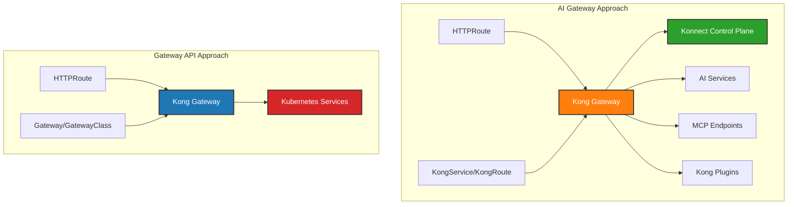

# Kong Operator KubeCon Demo

This repository demonstrates two approaches to deploying Kong Gateway with the Kong Operator on Kubernetes, showcasing different architectural patterns and use cases.

## Repository Structure

```
├── ai-gateway/          # Konnect + AI/MCP services approach
│   ├── README.md
│   └── kong/
│       ├── kong-gateway.yaml
│       ├── echo-service.yaml
│       ├── chuck-mcp.yaml
│       └── openai-service.yaml
└── gateway-api/         # Standard Gateway API approach
    ├── README.md  
    └── kong/
        ├── kong-gateway.yaml
        └── echo-route.yaml
```

## Two Implementation Approaches

### 🤖 [AI Gateway Approach](ai-gateway/)
**Advanced Kong features with Konnect cloud management**

- **Use Case**: Production-ready AI/API gateway with advanced routing and plugins
- **Control Plane**: Kong Konnect (cloud-managed)
- **Configuration**: Kong native CRDs (KongService, KongRoute, KongPlugin)
- **Features**: AI/MCP protocol support, external API proxying, vault integration, advanced plugins
- **Complexity**: Higher - includes Konnect setup, cert-manager, authentication

### 🌐 [Gateway API Approach](gateway-api/)  
**Standards-based Kubernetes Gateway API**

- **Use Case**: Simple, portable HTTP routing following Kubernetes standards
- **Control Plane**: Self-managed within cluster
- **Configuration**: Gateway API resources (HTTPRoute, Gateway, GatewayClass)
- **Features**: Basic HTTP routing, Kubernetes Service integration
- **Complexity**: Lower - minimal setup, no external dependencies

## Architecture Comparison



## Feature Comparison

| Feature | AI Gateway | Gateway API |
|---------|------------|-------------|
| **Control Plane** | Konnect (cloud-managed) | Self-managed |
| **Configuration Style** | Kong CRDs | Gateway API CRDs |
| **Routing** | KongRoute | HTTPRoute |
| **Backend Declaration** | KongService | Service references |
| **Plugin Support** | KongPlugin + KongPluginBinding | Limited (annotations) |  
| **External APIs** | ✅ Direct proxy | ❌ Requires Service |
| **AI/MCP Support** | ✅ Native plugins | ❌ Not supported |
| **Vault Integration** | ✅ KongVault | ❌ Not available |
| **Multi-cluster Management** | ✅ Via Konnect | ❌ Cluster-local |
| **Portability** | Kong-specific | ✅ Any Gateway controller |
| **Setup Complexity** | High | Low |
| **External Dependencies** | cert-manager, Konnect account | None |

## Quick Start

### Choose Your Approach

**For AI/Advanced Features:**
```sh
cd ai-gateway/
# Follow ai-gateway/README.md
```

**For Simple HTTP Routing:**  
```sh
cd gateway-api/
# Follow gateway-api/README.md
```

### Prerequisites

Both approaches require:
- Kubernetes cluster (v1.24+)
- `kubectl` configured
- Helm 3.x installed

**Additional for AI Gateway:**
- Kong Konnect account
- cert-manager
- Konnect API token

## Example Use Cases

### AI Gateway Scenarios
- **AI API Gateway**: Route requests to OpenAI, Anthropic, other AI services
- **MCP Protocol Support**: Model Context Protocol endpoints for AI tools
- **External API Proxying**: Direct integration with third-party APIs  
- **Advanced Security**: Kong Enterprise plugins for authentication, rate limiting
- **Multi-environment**: Centrally manage multiple clusters via Konnect

### Gateway API Scenarios
- **Cloud-Native Standard**: Follow Kubernetes Gateway API specifications
- **Vendor Portability**: Switch between Kong, Istio, Contour, others
- **Simple HTTP Services**: Basic load balancing and path-based routing
- **GitOps Friendly**: Standard Kubernetes resources, no vendor CRDs
- **Learning/Testing**: Minimal setup for experimenting with Gateway API

## Demo Services

Both approaches include demo services to test functionality:

- **Echo Service**: Returns request details for testing routing
- **Chuck Norris API** (AI Gateway only): External API integration example  
- **OpenAI Integration** (AI Gateway only): AI service configuration with vault

## Migration Path

You can start with the Gateway API approach for simplicity, then migrate to AI Gateway approach as your requirements grow:

1. **Start**: Gateway API for basic HTTP routing
2. **Migrate**: Switch to Kong CRDs when you need plugins
3. **Scale**: Add Konnect integration for multi-cluster management
4. **Enhance**: Enable AI/MCP features for advanced use cases

## Development Setup

Both approaches share the Kong Operator installation but diverge in configuration:

```sh
# Common setup
kubectl apply -f https://github.com/kubernetes-sigs/gateway-api/releases/download/v1.4.1/standard-install.yaml --server-side
helm repo add kong https://charts.konghq.com && helm repo update

# AI Gateway path
helm install kong-operator kong/kong-operator -n kong-system --create-namespace \
  --set image.tag=2.1 --set env.ENABLE_CONTROLLER_KONNECT=true \
  --set global.webhooks.options.certManager.enabled=true

# Gateway API path  
helm install kong-operator kong/kong-operator -n kong-system --create-namespace \
  --set image.tag=2.1 --set global.webhooks.options.certManager.enabled=true
```

## Troubleshooting

### Common Issues

**Gateway API Approach:**
- Verify GatewayClass is accepted: `kubectl get gatewayclass`
- Check Gateway status: `kubectl describe gateway kong -n kong`
- Validate HTTPRoute: `kubectl describe httproute -n kong`

**AI Gateway Approach:** 
- Verify Konnect connection: `kubectl describe konnectgatewaycontrolplane -n kong`
- Check DataPlane status: `kubectl describe dataplane -n kong`
- Validate KongService/KongRoute: `kubectl describe kongservice,kongroute -n kong`

### Debug Commands

```sh
# Kong Operator logs
kubectl logs -n kong-system -l app.kubernetes.io/name=kong-operator

# Gateway status (both approaches)
kubectl get gateway,httproute,kongservice,kongroute -n kong

# Service connectivity
kubectl exec -n kong deployment/echo -- curl localhost:1027
```

## Contributing

This repository serves as a demonstration for KubeCon presentations comparing Kong deployment patterns. For issues or improvements:

1. Check the approach-specific READMEs for detailed configuration
2. Test changes against both deployment patterns  
3. Ensure examples work with standard Kubernetes clusters
4. Update this comparison table when adding new features

## Resources

### Kong Resources
- [Kong Operator Documentation](https://docs.konghq.com/gateway-operator/)
- [Kong Konnect Documentation](https://docs.konghq.com/konnect/)
- [Kong Gateway Configuration](https://docs.konghq.com/gateway/latest/)

### Kubernetes Resources  
- [Gateway API Documentation](https://gateway-api.sigs.k8s.io/)
- [Kubernetes Service Documentation](https://kubernetes.io/docs/concepts/services-networking/service/)

### AI/MCP Resources
- [Model Context Protocol Specification](https://modelcontextprotocol.io/)
- [Kong AI Gateway Patterns](https://docs.konghq.com/hub/?category=ai)

---

**Choose your path and get started with Kong on Kubernetes! 🚀**