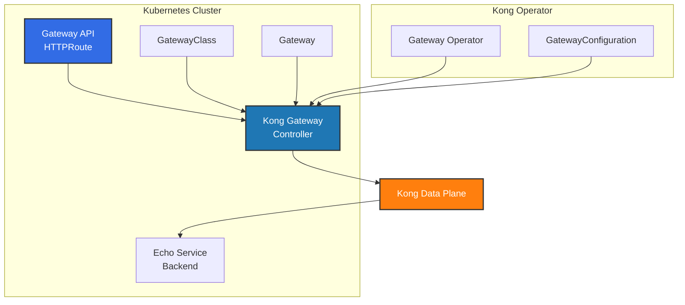

# Kong Operator with Gateway API

This approach demonstrates using Kong Gateway with standard Kubernetes Gateway API resources for portable, cloud-native HTTP routing.

## Overview

This Gateway API implementation provides:
- Standards-based Kubernetes Gateway API resources
- Kong Gateway as the Gateway Controller
- Simple HTTP routing without vendor lock-in
- Portable configuration across different Gateway implementations

## Architecture



## Prerequisites

- Kubernetes cluster (v1.24+)
- `kubectl` configured to access your cluster  
- Helm 3.x installed

## Installation Steps

### 1. Install Gateway API CRDs

```sh
kubectl apply -f https://github.com/kubernetes-sigs/gateway-api/releases/download/v1.4.1/standard-install.yaml --server-side
```

### 2. Install Kong Operator

Add Kong Helm Repository:

```sh
helm repo add kong https://charts.konghq.com
helm repo update
```

Install Kong Operator using Helm:

```sh
helm upgrade --install kong-operator kong/kong-operator -n kong-system \
  --create-namespace \
  --set image.tag=2.1 \
  --set global.webhooks.options.certManager.enabled=true
```

### 3. Add Enterprise License (Optional)

If using Kong Enterprise:

```sh
echo "apiVersion: configuration.konghq.com/v1alpha1
kind: KongLicense
metadata:
  name: kong-license
rawLicenseString: '$KONG_LICENSE_DATA'" | kubectl apply -f -
```

### 4. Create Kong Namespace

```sh
kubectl create namespace kong
```

### 5. Deploy Gateway Resources

Apply Kong Gateway configurations:

```sh
kubectl apply -f kong/kong-gateway.yaml
```

This creates:
- **GatewayConfiguration**: Kong-specific settings (image, version)
- **GatewayClass**: Controller binding for Kong Gateway Operator  
- **Gateway**: HTTP listener on port 80

### 6. Create Backend Service

Deploy the echo service for testing:

```sh
kubectl apply -f https://developer.konghq.com/manifests/kic/echo-service.yaml -n kong
```

### 7. Configure Routes

Apply the HTTP route configuration:

```sh
kubectl apply -f kong/echo-route.yaml
```

### 8. Verify Installation

Check Gateway status:

```sh
kubectl get -n kong gateway kong \
  -o=jsonpath='{.status.conditions[?(@.type=="Programmed")]}' | jq
```

Check HTTPRoute status:

```sh
kubectl get httproute echo -n kong -o yaml
```

## Testing the Setup

Get the Gateway external IP:

```sh
GATEWAY_IP=$(kubectl get gateway kong -n kong -o jsonpath='{.status.addresses[0].value}')
```

Test the echo endpoint:

```sh
curl http://$GATEWAY_IP/echo
```

You should see a response from the echo service showing request details.

## Configuration Files

- [`kong/kong-gateway.yaml`](kong/kong-gateway.yaml) - GatewayClass and Gateway configuration 
- [`kong/echo-route.yaml`](kong/echo-route.yaml) - HTTPRoute for echo service

## Gateway API vs Kong Native CRDs

This approach uses standard Gateway API resources instead of Kong's native CRDs:

| Aspect | Gateway API | Kong Native CRDs |
|--------|-------------|------------------|
| **Routing** | HTTPRoute | KongRoute |
| **Backends** | Service references | KongService |
| **Plugins** | Limited via annotations | KongPlugin + KongPluginBinding |
| **Portability** | Works with any Gateway controller | Kong-specific |
| **Advanced Features** | Basic HTTP routing | Full Kong feature set |

## Troubleshooting

### Check Kong Operator Status

```sh
kubectl logs -n kong-system -l app.kubernetes.io/name=kong-operator
```

### Verify Gateway API Resources

```sh
kubectl get gatewayclass,gateway,httproute -n kong
```

### Debug Gateway Issues

```sh
kubectl describe gateway kong -n kong
kubectl describe httproute echo -n kong
```

## Cleanup

Remove all resources:

```sh
kubectl delete httproute echo -n kong
kubectl delete gateway kong -n kong  
kubectl delete gatewayclass kong
kubectl delete namespace kong
helm uninstall kong-operator -n kong-system
kubectl delete namespace kong-system
```

## Next Steps

- Explore the [AI Gateway approach](../ai-gateway/README.md) for advanced Kong features
- Check the [main repository README](../README.md) for approach comparison
- Review [Gateway API documentation](https://gateway-api.sigs.k8s.io/) for more routing options

## Resources

- [Gateway API Documentation](https://gateway-api.sigs.k8s.io/)
- [Kong Gateway Operator Documentation](https://docs.konghq.com/gateway-operator/) 
- [Kong Gateway Configuration](https://docs.konghq.com/gateway/latest/)
